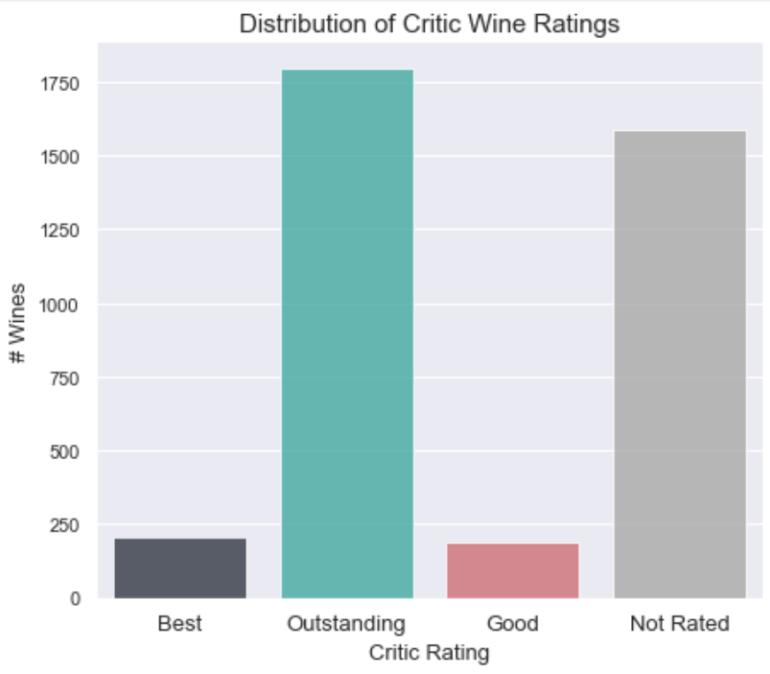
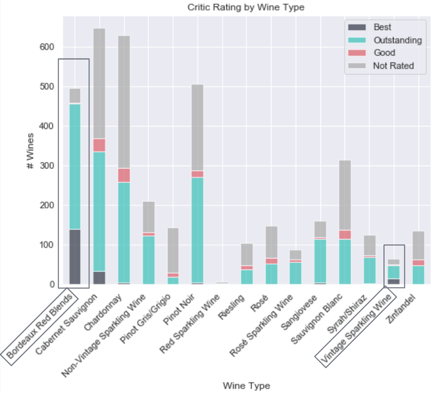
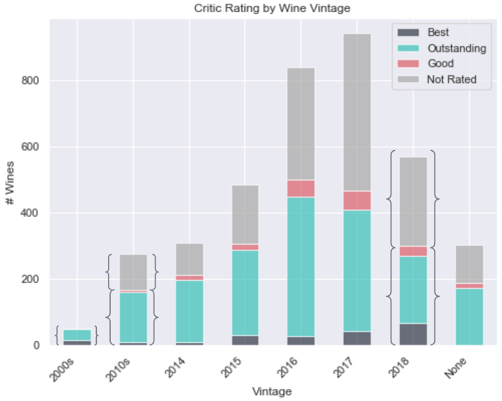
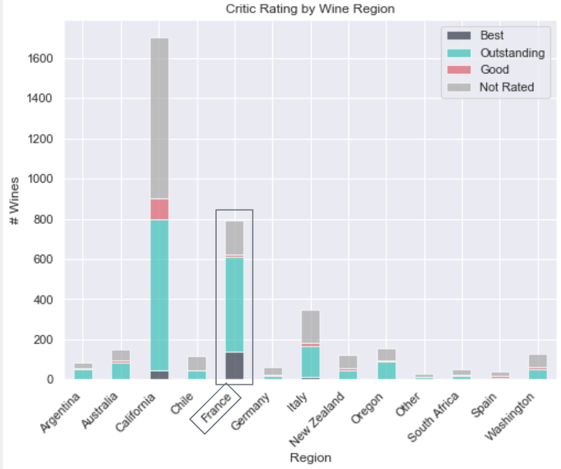
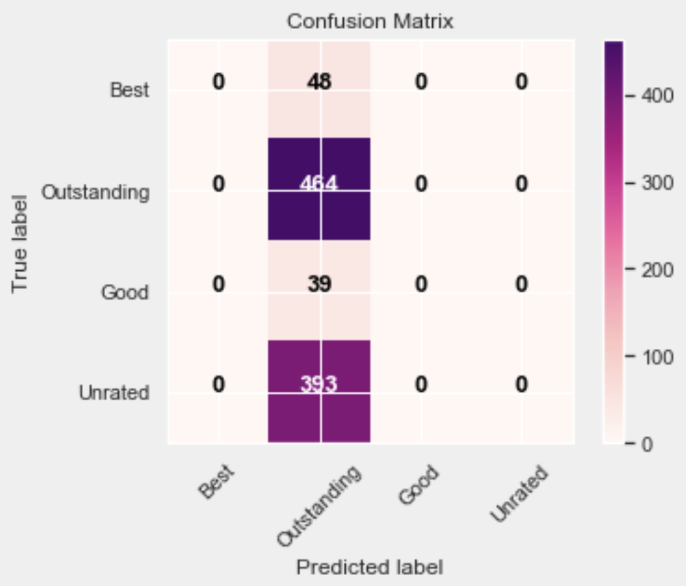
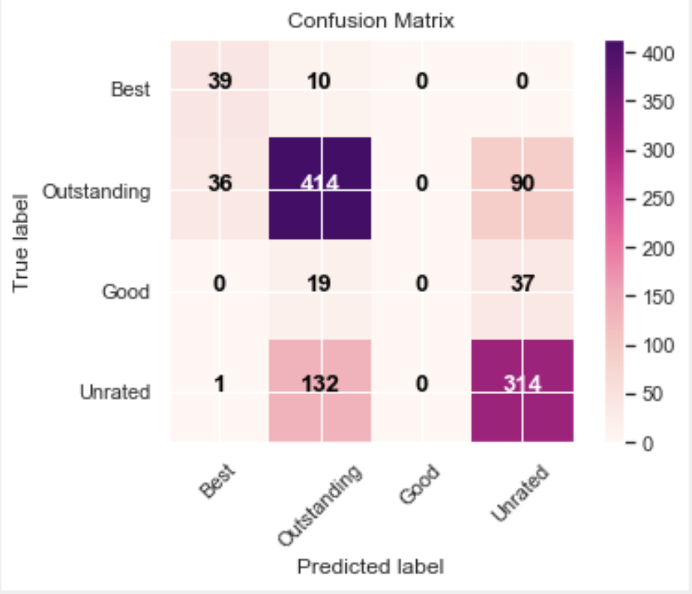
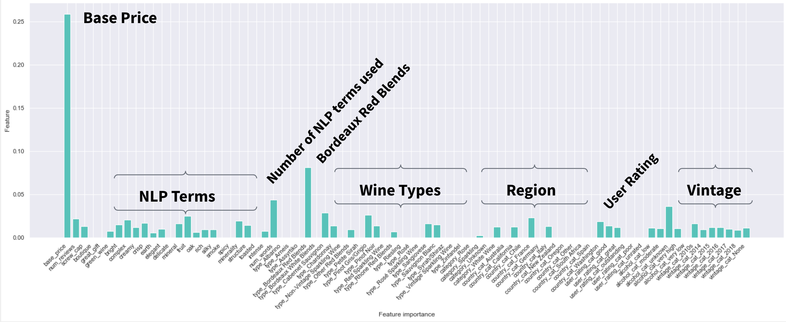
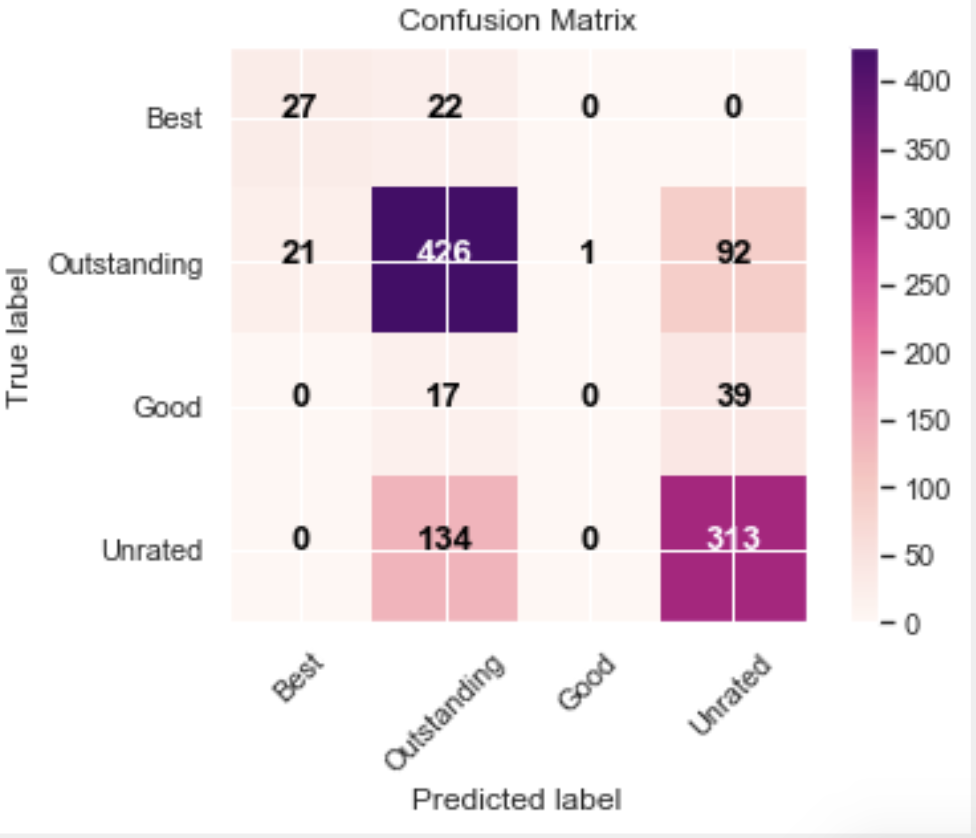
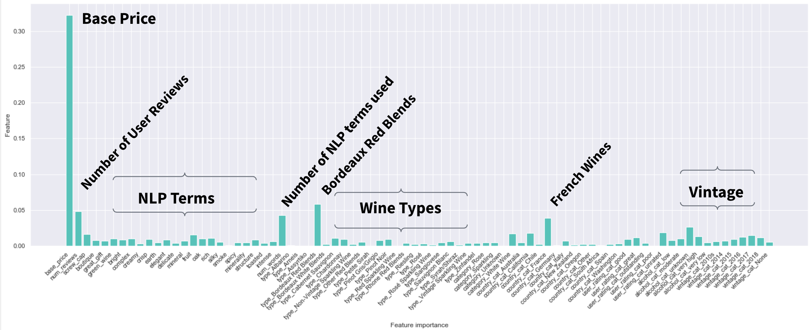

# Picking Up Wines
## Using Supervised Machine Learning to Identify Critically Rated Wines

### Problem
When going to pick up a bottle of wine, we often rely on wine critic ratings such as Wine Spectator, the Wine Advocate, Wine.com, etc. Since we trust the wine critics to have a more refined palate and more discerning taste, we expect that a high rating (> 90 points) indicates a good quality wine and therefore a good buy. 

Can we predict how well-rated a wine is by critics using basic information about that wine? And while ratings on old vintages and popular wines are often available, that might not be the case for new wines.Can we use our model to determine if a new wine is worth trying  - that is, identify “undiscovered” wines? (And, even more interestingly, if our model performs well using information that does not directly influence how a wine tastes, would our prefictive model performing well indicate that wine critic ratings are biased or untrustworthy?)

### Dataset
Data for 4300+ wines was scraped from [wine.com](wine.com), an online wine store that includes some of the most extensive information available about wines. This includes:
- Wine Name
- Wine Category (e.g. Red, White, Sparkling, etc.)
- Vintage (year, or undisclosed if a blend)
- Wine Type (e.g. Cabernet Sauvignon, Merlot, etc.)
- Winery that produces the wine
- Winery-produced notes about the wine
- Country of origin
- Region (if available)
- Alcohol percentage
- Base price
- Current price
- Discount (Base price - current price)
- Size of bottle (e.g. 750 mL)
- User rating
- Number of reviews
- Wine.com-specific tags that are either True or False, such as:
    - Screw cap
    - Boutique (few bottles produced)
    - "Great Gift" (to reiterate, these are chosen by Wine.com)
    - Green wine (environmentally friendly)
    - Collectible

Note that some information like alcohol percentage and region were not always available.

### Features
80 features were engineered using the scraped data. Some examples of data engineering and data cleaning includ:
- Parsing country and region
- Creating a bag-of-words for the most common and descriptive wine note words such as:
'bright', 'complex', 'creamy', 'crisp', 'earth', 'elegant', 'delicate', 'mineral', 'fruit', 'oak', 'rich', 'silky', 'smoke', 'spicy', 'minerality', 'structure', 'toasted', 'rich', 'intense'
- One-hot encoding categorical features such as wine type and vintage

Note that not all categorical features were one-hot encoded. There were almost 1,000 wineries for 4,300+ wines, so this feature wasn't included in the modeling.

### Exploratory Data Analysis (EDA)

Critic ratings were split into categories based on the numerical wine rating.
- **100 to 95:** Best
- **95 to 90:** Outstanding
- **90 to 85:**  Good
- **<85: Not Rated
Note: In general, wine critics will not "rate" a wine if it is not good. In my dataset, I didn't have any wines rated less than 85 points.

If we look at the critic rating by wine type, we see that some wine types (Bordeaux Red Blends, Vintage Sparkling Wines) has a higher proportion of Best & Outstanding rated wines than other types (such as Pinot Gris/Grigio and Rose). This indicates wine type may be a predictive feature.

Likewise, wine vintage also seems to be predictive. Older wines available on Wine.com (e.g. vintage earlier than 2010) seem to be exclusively critically rated wines. Moreover, looking at the proportion of critically rated wines for wine vintages in the 2010s is closer to 2/3rds vs 1/2 for 2018 wines.

Wine.com, being a US-based website, has a majority of wines from California. If we look at wines from France, however, we see a much higher proportion are critically acclaimed. 

### Models

#### Baseline Model Performance
Our baseline model is the "assume we know nothing" model,  or assume all wines are “Outstanding” (most populated class)

Accuracy = 49%
Recall = 49%
Precision = 24%
F1-Score = 32% 
(scores are weighted averages of all classes)

#### Best Performing Model
XGBoost’s recall was best out of all the models, especially for the “Best” category (largest proportion of “Best” wines captured)
XGBoost also had double the F1-Score (67%) and 20% more accuracy compared to our base model. 

Accuracy = 70%
Recall = 70%
Precision = 67%
F1-Score = 68% 
(scores are weighted averages of all classes)

As we observe the feature importance to find out what makes a critically acclaimed wine, unfortunately the price is the most predictive feature. That being said, the XGBoost was able to distinguish between features that had no predictive value (e.g.  wines that were marked as "great gift" or "boutique") and more important features (e.g. Bordeaux Reds, which we saw in the EDA as having a lot of critically acclaimed wines)

#### Comparison to Other Model (Random Forest)
As mentioned, XGBoost was chosen as the best model because the Recall score for "Best" wines was the highest (80%). Average weighted recall was also the highest overall. Notice how the Random Forest model was not able to identify "Best" wines as well—especially given the class imbalance

Lastly, Random Forest was not as discerning for feature importance when compared to XGBoost (as shown by the less varied Feature Importance chart. Note that AdaBoost and Logistic Regression performed similarly to Random Forest.

